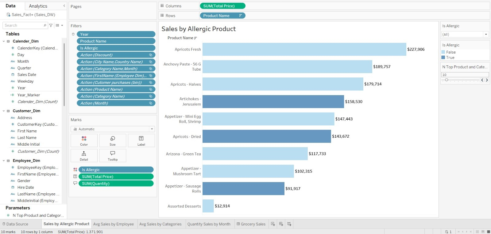

# Grocery Sales Analysis Dashboard (Tableau + Power BI + Excel)

Interactive dashboards to analyze grocery sales KPIs, trends, and customer segments.
Built in **Tableau** and **Power BI**, with **Excel** data prep.

## Demo

### Tableau Dashboard

**Screenshots**
  
  
  
  
  

---

### Power BI Dashboard

**Screenshots**
  
  
  
  
  

`

## Highlights
- KPI tiles (Revenue, Profit, AOV, Units)
- Time-series with YoY
- Category & sub-category (Pareto)
- Customer segmentation and top 10
- Filters: date, region, channel, category

## Repo Structure
grocery-sales-dashboard/
├─ data/
├─ tableau/
├─ powerbi/
├─ excel/
├─ images/
├─ docs/
└─ scripts/

## How to Use
- **Tableau:** open `.twbx` in `/tableau/`.
- **Power BI:** open `.pbix` in `/powerbi/`.
- **Excel:** store Power Query / pivots in `/excel/`.

## Data Notes
- Anonymized/simulated data only. Put small samples in `/data/`.

## License
MIT (see `LICENSE`).

## Author
**Rutuja A. Bhatankar**  
MS in FinTech | Data Analyst | BI Enthusiast
